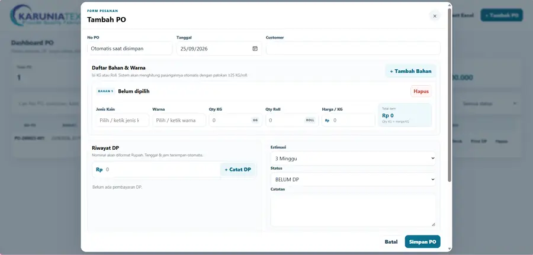
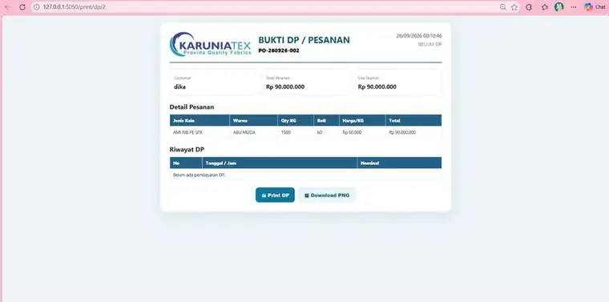
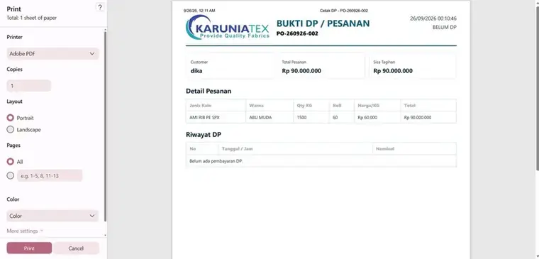

# KaruniaTex PO Management System

Aplikasi web untuk mengelola **Purchase Order tekstil**, pembayaran DP, master data, foto bukti, print workflow, dan laporan Excel.

## Preview Fitur

### 1. Dashboard PO

Menampilkan ringkasan total PO, proses, ready, done, sisa tagihan, pencarian, filter status, sorting No PO, pagination, foto, dan menu aksi.


### 2. Form Tambah PO

Form input pesanan baru yang mendukung multi bahan dan warna, Qty KG, estimasi Roll, harga per KG, pencatatan DP, status, catatan, dan upload foto.



### 3. Master Data

Halaman untuk mengelola **customer, jenis kain, dan warna** agar pilihan pada form PO lebih cepat dan konsisten.


### 4. Bukti DP / Pesanan

Menampilkan identitas PO, customer, total pesanan, sisa tagihan, detail bahan/warna, Qty KG, Roll, harga, serta riwayat pembayaran DP.



### 5. Print Preview

Bukti DP / Pesanan dapat dibuka dalam tampilan print preview sehingga siap dicetak atau disimpan menjadi PDF.



### 6. Export Laporan Excel

Contoh hasil export laporan PO ke Excel. Workbook menyediakan sheet **Ringkasan**, **Laporan PO**, **Detail Item**, dan **Riwayat DP** untuk memudahkan pengecekan dan dokumentasi.


## Fitur Utama

- Dashboard monitoring PO
- Nomor PO otomatis dan tidak dapat diedit
- Multi bahan dan warna dalam satu PO
- Qty KG dan estimasi Roll
- Perhitungan total pesanan otomatis
- Pencatatan DP lebih dari satu kali
- Perhitungan sisa tagihan
- Multi upload foto
- Popup preview foto
- Master customer, jenis kain, dan warna
- Riwayat harga customer
- Copy pesanan ke WhatsApp
- Print Bukti DP / Pesanan
- Download Bukti DP dalam format PNG
- Print struk
- Import Excel
- Export laporan Excel multi-sheet
- Sort No PO A–Z / Z–A
- Filter status dan pencarian
- Checkbox dan bulk delete PO
- Pagination maksimal 10 PO per halaman
- Tutorial penggunaan
- Responsive UI

## Export Laporan Excel

Laporan PO dapat diexport ke workbook Excel yang dipisahkan menjadi beberapa sheet:

- **Ringkasan**
- **Laporan PO**
- **Detail Item**
- **Riwayat DP**

## Tech Stack

- **Backend:** Python, Flask
- **Database:** SQLite
- **Frontend:** HTML/Jinja2, CSS, JavaScript
- **Excel Processing:** openpyxl

## Struktur Data

- Transaksi dan customer disimpan menggunakan SQLite.
- Master jenis kain dan warna tersimpan pada `data/master.json`.
- Foto bukti PO tersimpan pada `static/uploads/`.
- Database transaksi dan foto operasional tidak dimasukkan ke repository melalui `.gitignore`.

## Menjalankan Aplikasi

1. Clone repository.
2. Install dependency:

   ```bash
   pip install -r requirements.txt
   ```

3. Jalankan aplikasi:

   ```bash
   python app.py
   ```

4. Buka melalui browser:

   ```text
   http://127.0.0.1:5050
   ```

Database transaksi dibuat otomatis saat aplikasi pertama kali dijalankan.
