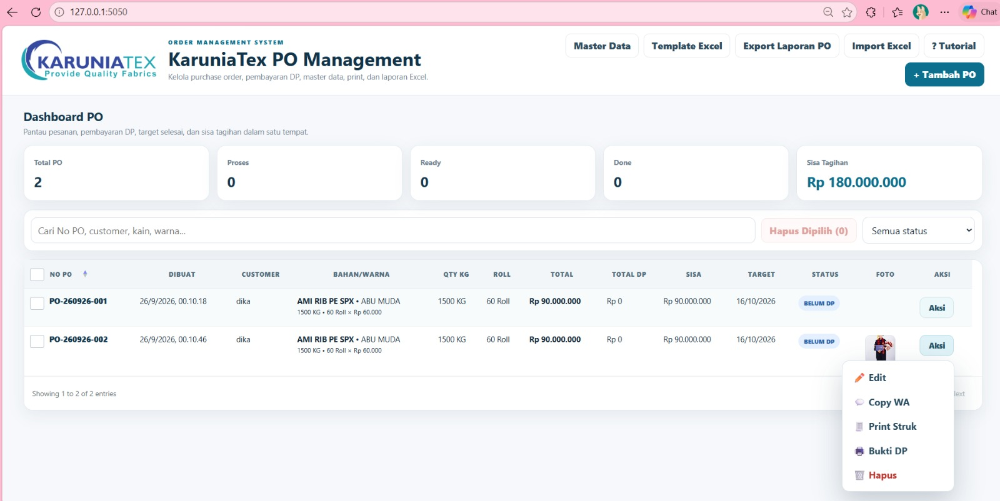

# KaruniaTex PO Management System

Aplikasi web untuk mengelola Purchase Order tekstil, pembayaran DP, master data, foto bukti, print workflow, dan laporan Excel.

## Preview Fitur

Preview utama menggunakan screenshot dashboard resolusi penuh agar tampilan fitur tetap tajam dan mudah dibaca di GitHub.

## Fitur
- Dashboard monitoring PO
- Multi bahan dan warna dalam satu PO
- Qty KG dan estimasi Roll
- Pencatatan beberapa kali DP
- Multi upload foto
- Master customer, jenis kain, dan warna
- Copy pesanan ke WhatsApp
- Print bukti DP
- Print struk
- Download bukti DP PNG
- Import template Excel
- Export laporan Excel multi-sheet
- Sort No PO A–Z / Z–A
- Checkbox pilih PO
- Bulk delete PO terpilih
- Tutorial penggunaan yang bisa dilewati dan dibuka ulang
- Responsive UI
- Pagination maksimal 10 PO per halaman
- Popup preview foto

## Tech Stack
Python, Flask, SQLite, HTML/Jinja2, CSS, JavaScript, dan openpyxl.

## Data
- Transaksi dan customer: SQLite
- Master kain/warna: `data/master.json`
- Foto: `static/uploads/`

## Menjalankan
1. Install dependency:
   `pip install -r requirements.txt`
2. Jalankan:
   `python app.py`
3. Buka:
   `http://127.0.0.1:5050`

Database transaksi dibuat otomatis saat pertama kali aplikasi dijalankan.
